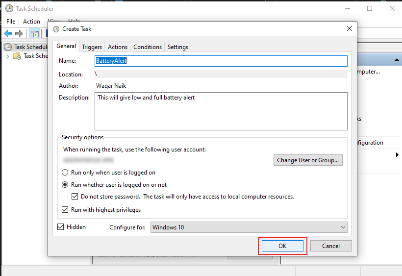

# 🔋 BatteryAlert

BatteryAlert is a PowerShell script that helps you manage your laptop battery health by notifying you when the battery is low at 30% or fully charged at 80%.

## ✔ Why it's Recommended to charge at 80% and discharge at 30% laptop battery?

Maintaining a charge between 30% and 80% is endorsed by most laptop manufacturers as it contributes to prolonged battery lifespan, minimizing unexpected shutdowns, and optimizing long-term performance.

For more information:
- [HP - How Long Should I Charge My HP Laptop Battery?](https://www.hp.com/us-en/shop/tech-takes/how-long-should-i-charge-hp-laptop-battery)
- [Battery University - BU-808: How to Prolong Lithium-based Batteries](https://batteryuniversity.com/article/bu-808-how-to-prolong-lithium-based-batteries)

## ⬇ Installation Steps

1. **Download the Script:**
   - Download latest release from this repo.

2. **Copy Script Folder:**
   - Extract zip and Copy the **BatteryAlert** Folder to **"C:\Program Files\"**.

3. **Open Task Scheduler:**
   - Press Win + S to open the search bar.
   - Type "Task Scheduler" and press Enter to open Task Scheduler.

4. **Import Task:**
   - In the right-hand Actions pane, click on "Import Task...".  
  

   - Navigate to the location where you extracted zip and select **"BatteryAlert.xml"** file under **"Installation Steps Folder"** and click "Open."  
  

5. **Save BatteryAlert Task:**
   - In Task Scheduler, click on "OK".  
  

   - Click on "Task Scheduler Library" you'll see BatterAlert Task has been created in Task scheduler. (if you dont see just click refresh, In the right-hand Actions pane).  
  

6. **Start BatterAlert Task Manually:**
   - Right-click on BatterAlert task and Select "Run" to execute the task manually.  
  

## ✨ Notes

	- (Optional) After All the installation, you can better restart your laptop to read battery percentage and run the script properly.
	- If you find that BatteryAlert is not running, In task scheduler follow above step 6.
	- This script supported for Windows 7+.
